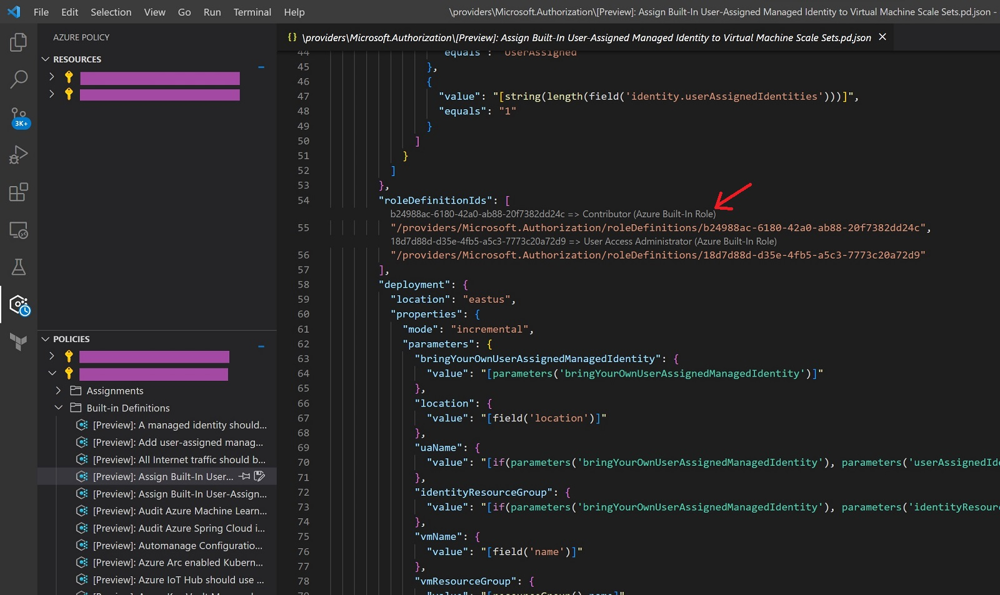

# GUID Sniffer

Status: Experimental POC

In a nutshell: Extension creates annotates the descriptions of some well-known (Microsoft Azure) GUIDs above the line.

GUIDs are 128-bit identifiers that are not easy for humans to compare, let alone to remember. Despite that, there are "Well-known GUIDs" that frequently come up.

Goal of this extension is to shorten the amount of time spent with putting GUIDs to search engines.

Main use case: Reviewing code, documents or configuration that contain GUIDs (see Demo below). Situations where you cannot make the code or text to get rid of the anti-pattern of using GUID strings as magic constants. Or where you cannot use better tooling to view them.

## GUID data (bundled)

 - Built-in Azure roles
 - Built-in/Static Azure policy definitions

## Features

 - Shows GUID name and source as annotations
 - Shows a GUID description as a tooltip
 - Opens browser for azadvertizer.net when Azure-related annotation clicked

In scope (now, future):

 - Adding configuration to include local identifier files
 - Microsoft-land, especially Azure related GUIDs.
 - Expanding/including to contain what is well-known and often useful
 - Expanding to cover Windows SIDs later(?)

## Ideas for tuture

- Add configuration to include local GUID's
- Show SID's?

## Demo (combined with Azure Policy extension)

Works with any text files. Does not have to be local.

Combined with Azure Policy VS Code extension, you can browse your Azure Policy definitions live and see them annotated. 

## VS Code API

FIXME: Update (this stuff is from the example).

### `languages` module

- [`languages.registerCodeLensProvider`](https://code.visualstudio.com/api/references/vscode-api#languages.registerCodeLensProvider)

### CodeLens Provider

- [`CodeLensProvider`](https://code.visualstudio.com/api/references/vscode-api#CodeLensProvider)
- [`CodeLensProvider.provideCodeLenses`](https://code.visualstudio.com/api/references/vscode-api#CodeLensProvider.provideCodeLenses)
- [`CodeLensProvider.resolveCodeLens`](https://code.visualstudio.com/api/references/vscode-api#CodeLensProvider.resolveCodeLens)

## Running the Sample

- Run `npm install` in terminal to install dependencies
- Run the `Run Extension` target in the Debug View. This will:
	- Start a task `npm: watch` to compile the code
	- Run the extension in a new VS Code window
